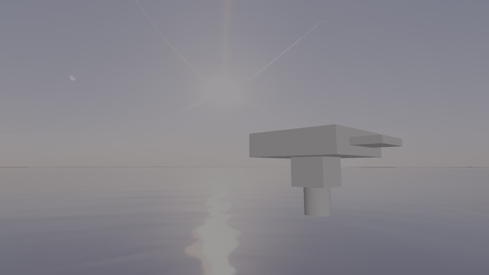
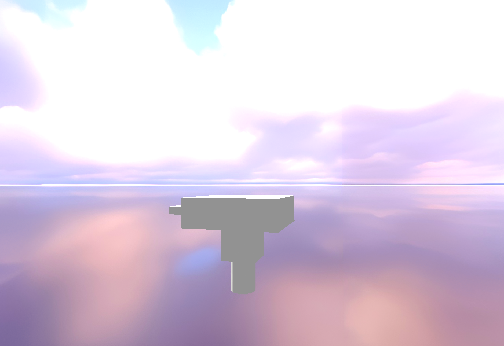

# Vulkan 3D Renderer

A modern 3D rendering application written in **C++20** using **Vulkan**.
The renderer provides a flexible foundation for real-time 3D graphics and supports custom meshes, shaders, lighting, shadows, textures, camera movement, and skyboxes.

## Features

* **Vulkan-based 3D rendering**
* **C++20**
* **Visual Studio 2026**
* Custom mesh loading
* Custom shaders
* Local shadowing
* Real-time camera movement
* Texture loading and mapping
* Skybox rendering
* GLM for mathematics
* GLFW3 for window and input management

## Screenshots

### Frame 1

### Frame 2

## Technology Stack

| Technology             | Purpose                                             |
| ---------------------- | --------------------------------------------------- |
| **C++20**              | Core programming language                           |
| **Vulkan**             | Low-level graphics and rendering API                |
| **GLFW3**              | Window creation, input, and Vulkan surface handling |
| **GLM**                | Mathematics, vectors, matrices, and transformations |
| **Visual Studio 2026** | Development environment                             |

The project targets the latest available versions of the libraries and tools.

## Rendering Features

### Custom Meshes

The renderer can load and display custom 3D meshes, allowing scenes to be built from external geometry rather than being limited to predefined primitives.

### Shaders

Rendering is controlled through custom Vulkan shaders, providing flexibility for different rendering techniques and material effects.

### Local Shadowing

The renderer supports local shadowing to provide dynamic depth and lighting information within the scene.

### Camera Movement

The camera can be moved through the 3D environment in real time, making it possible to inspect the rendered scene from different perspectives.

### Texturing

Textures can be applied to meshes to add surface detail and improve the visual appearance of rendered objects.

### Skybox

A skybox surrounds the scene with a textured environment, providing an atmospheric background and making the rendered world feel more immersive.

## Requirements

To build and run the project, you need:

* **Visual Studio 2026**
* A compiler with **C++20** support
* **Vulkan SDK**
* A Vulkan-compatible GPU and driver
* **GLFW3**
* **GLM**

Make sure the Vulkan SDK and required dependencies are correctly installed and available to the build environment.

## Build

Open the project in **Visual Studio 2026** and build it using the appropriate configuration.

Before running the application, make sure that:

1. Your GPU supports the required Vulkan features.
2. Your Vulkan drivers are up to date.
3. The Vulkan SDK is installed and configured.
4. Required runtime assets such as meshes, textures, shaders, and skybox textures are available at the expected paths.

## Project Overview

The renderer follows a Vulkan-based rendering pipeline and combines GPU resources, shaders, meshes, textures, lighting, and camera transformations to produce the final image.

A typical frame consists of:

1. Processing user input and updating the camera.
2. Preparing scene and object transformations.
3. Updating lighting and shadow information.
4. Binding meshes, textures, and shaders.
5. Recording Vulkan rendering commands.
6. Rendering the scene and skybox.
7. Presenting the final image to the screen.
